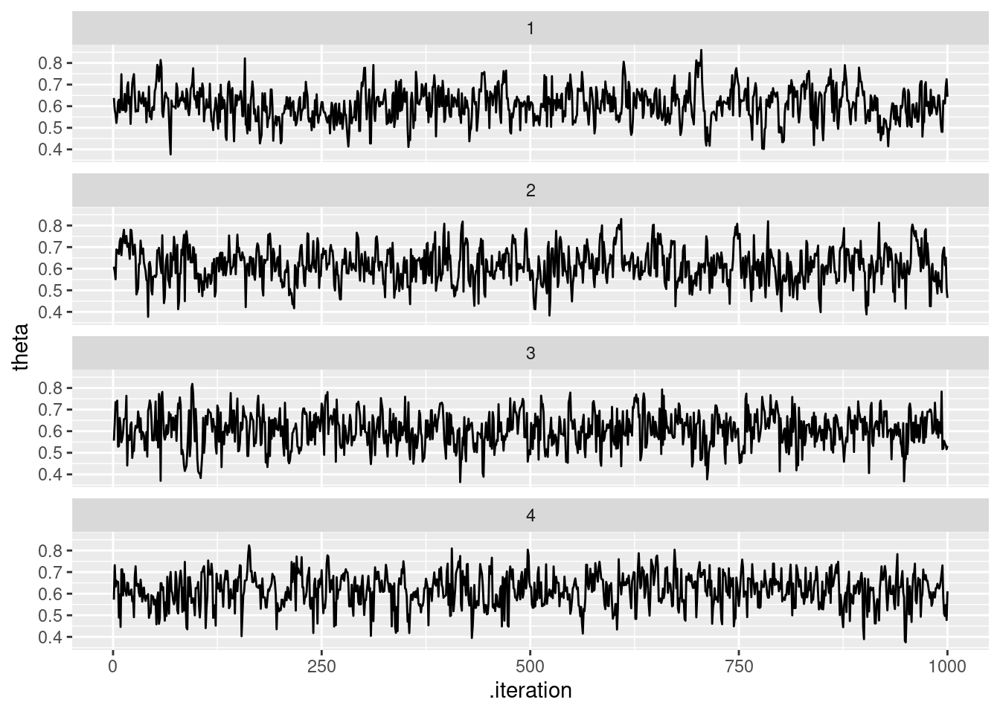
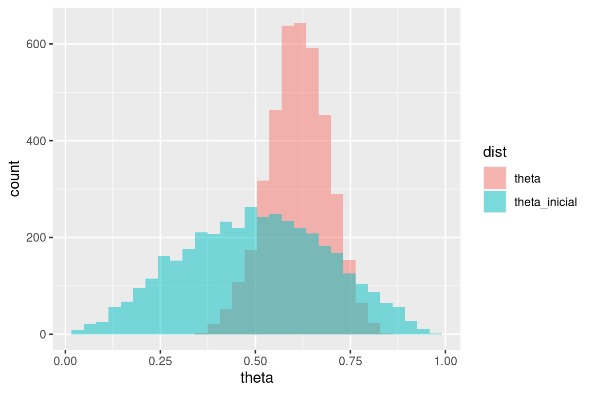
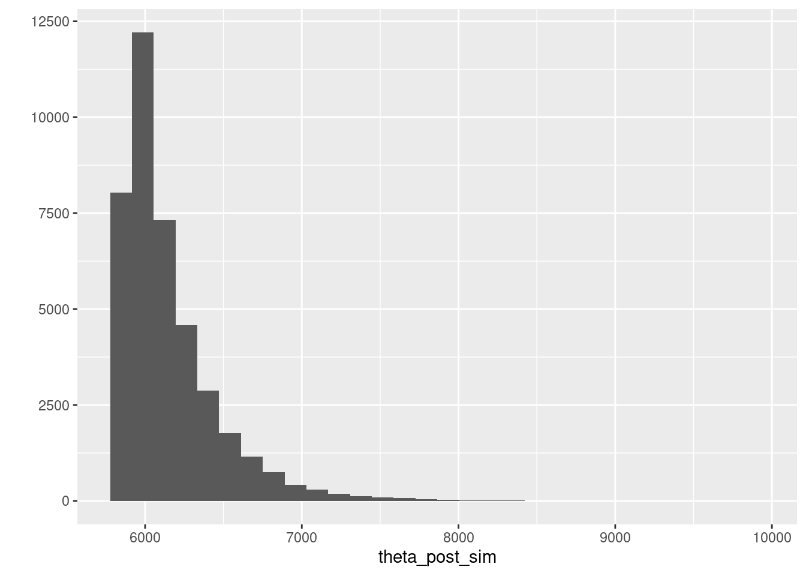
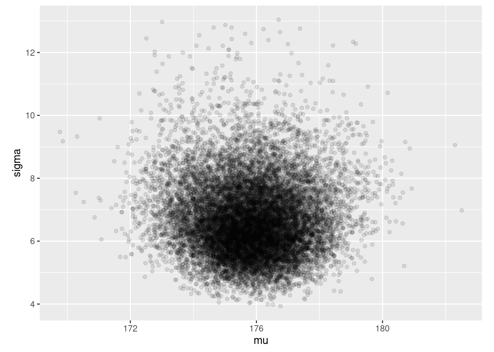
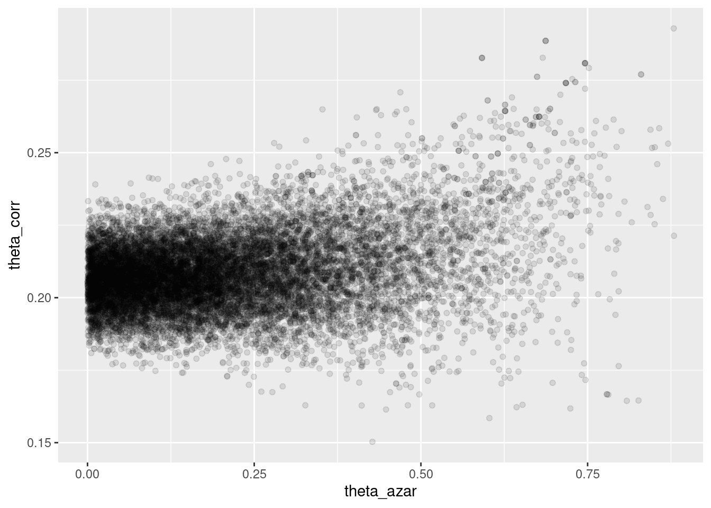

# Ejemplos de inferencia bayesiana en Stan I


En esta parte veremos cómo correr y diagnosticar en Stan varios ejemplos vistos en clase. Para instalar *cmdstanr* y Stan, puedes ver [aquí](https://mc-stan.org/cmdstanr/). En python puedes usar *pystan*, por ejemplo.


```r
# install.packages("cmdstanr", repos = c("https://mc-stan.org/r-packages/", getOption("repos")))
library(cmdstanr)
library(posterior)
library(tidyverse)
```


## Estimación de una proporción {-}

Escribimos el código para el modelo en un archivo *modelo-1.stan*, 
y compilamos:


```r
archivo_stan <- file.path("stan/modelo-1.stan")
# compilar
mod <- cmdstan_model(archivo_stan)
```


```r
mod
```

```
## // Ejemplo de estimación de una proporcion
## data {
##   int n; // número de pruebas
##   int y; //numero de éxitos y fracasos
## }
## 
## parameters {
##   real<lower=0,upper=1> theta;
## }
## 
## model {
##   // inicial
##   theta ~ beta(3, 3);
##   y ~ binomial(n, theta);
## }
## 
## generated quantities {
##   real theta_inicial;
##   theta_inicial = beta_rng(3, 3);
## }
```

Pasamos datos y muestreamos


```r
datos_lista <- list(n = 30, y = 19)
ajuste <- mod$sample(
  data = datos_lista,
  seed = 1234,
  chains = 4,
  parallel_chains = 4,
  refresh = 500)
```

```
## Running MCMC with 4 parallel chains...
## 
## Chain 1 Iteration:    1 / 2000 [  0%]  (Warmup) 
## Chain 1 Iteration:  500 / 2000 [ 25%]  (Warmup) 
## Chain 1 Iteration: 1000 / 2000 [ 50%]  (Warmup) 
## Chain 1 Iteration: 1001 / 2000 [ 50%]  (Sampling) 
## Chain 1 Iteration: 1500 / 2000 [ 75%]  (Sampling) 
## Chain 1 Iteration: 2000 / 2000 [100%]  (Sampling) 
## Chain 2 Iteration:    1 / 2000 [  0%]  (Warmup) 
## Chain 2 Iteration:  500 / 2000 [ 25%]  (Warmup) 
## Chain 2 Iteration: 1000 / 2000 [ 50%]  (Warmup) 
## Chain 2 Iteration: 1001 / 2000 [ 50%]  (Sampling) 
## Chain 2 Iteration: 1500 / 2000 [ 75%]  (Sampling) 
## Chain 2 Iteration: 2000 / 2000 [100%]  (Sampling) 
## Chain 3 Iteration:    1 / 2000 [  0%]  (Warmup) 
## Chain 3 Iteration:  500 / 2000 [ 25%]  (Warmup) 
## Chain 3 Iteration: 1000 / 2000 [ 50%]  (Warmup) 
## Chain 3 Iteration: 1001 / 2000 [ 50%]  (Sampling) 
## Chain 3 Iteration: 1500 / 2000 [ 75%]  (Sampling) 
## Chain 3 Iteration: 2000 / 2000 [100%]  (Sampling) 
## Chain 4 Iteration:    1 / 2000 [  0%]  (Warmup) 
## Chain 4 Iteration:  500 / 2000 [ 25%]  (Warmup) 
## Chain 4 Iteration: 1000 / 2000 [ 50%]  (Warmup) 
## Chain 4 Iteration: 1001 / 2000 [ 50%]  (Sampling) 
## Chain 4 Iteration: 1500 / 2000 [ 75%]  (Sampling) 
## Chain 4 Iteration: 2000 / 2000 [100%]  (Sampling) 
## Chain 1 finished in 0.0 seconds.
## Chain 2 finished in 0.0 seconds.
## Chain 3 finished in 0.0 seconds.
## Chain 4 finished in 0.0 seconds.
## 
## All 4 chains finished successfully.
## Mean chain execution time: 0.0 seconds.
## Total execution time: 0.3 seconds.
```

Checamos diagnósticos:


```r
ajuste$cmdstan_diagnose()
```

```
## Processing csv files: /tmp/Rtmpv7c8tl/modelo-1-202311292012-1-8a4b85.csv, /tmp/Rtmpv7c8tl/modelo-1-202311292012-2-8a4b85.csv, /tmp/Rtmpv7c8tl/modelo-1-202311292012-3-8a4b85.csv, /tmp/Rtmpv7c8tl/modelo-1-202311292012-4-8a4b85.csv
## 
## Checking sampler transitions treedepth.
## Treedepth satisfactory for all transitions.
## 
## Checking sampler transitions for divergences.
## No divergent transitions found.
## 
## Checking E-BFMI - sampler transitions HMC potential energy.
## E-BFMI satisfactory.
## 
## Effective sample size satisfactory.
## 
## Split R-hat values satisfactory all parameters.
## 
## Processing complete, no problems detected.
```

Si no hay problemas, podemos ver el resumen:


```r
ajuste$summary()
```

```
## # A tibble: 3 × 10
##   variable    mean  median     sd    mad      q5     q95  rhat ess_bulk ess_tail
##   <chr>      <num>   <num>  <num>  <num>   <num>   <num> <num>    <num>    <num>
## 1 lp__     -24.5   -24.3   0.694  0.289  -26.0   -24.1    1.00    1845.    2051.
## 2 theta      0.611   0.613 0.0787 0.0786   0.476   0.739  1.00    1324.    1635.
## 3 theta_i…   0.500   0.502 0.190  0.208    0.189   0.813  1.00    4182.    4102.
```

Donde verificamos que el tamaño de muestra efectivo (ess) y el diagnóstico de
$\hat{R}$ son apropiados.

Podemos ver las cadenas de la siguiente forma:


```r
theta_tbl <- ajuste$draws(c("theta", "theta_inicial")) %>% as_draws_df()
ggplot(theta_tbl, aes(x = .iteration, y = theta)) +
  geom_line() +
  facet_wrap(~.chain, ncol = 1)
```



Y replicamos la gráfica de las notas haciendo:


```r
sims_tbl <- theta_tbl %>% pivot_longer(theta:theta_inicial, names_to = "dist", values_to = "theta")
```

```
## Warning: Dropping 'draws_df' class as required metadata was removed.
```

```r
ggplot(sims_tbl, aes(x = theta, fill = dist)) + 
  geom_histogram(aes(x = theta), bins = 30, alpha = 0.5, position = "identity")
```



## Estimación del máximo de una uniforme {-}

Tomamos el ejemplo de los boletos de lotería,


```r
loteria_tbl <- read_csv("data/nums_loteria_avion.csv", col_names = c("id", "numero")) %>% 
  mutate(numero = as.integer(numero))
```

```
## Rows: 99 Columns: 2
## ── Column specification ────────────────────────────────────────────────────────
## Delimiter: ","
## chr (1): numero
## dbl (1): id
## 
## ℹ Use `spec()` to retrieve the full column specification for this data.
## ℹ Specify the column types or set `show_col_types = FALSE` to quiet this message.
```

```r
set.seed(334)
muestra_loteria <- sample_n(loteria_tbl, 25) %>% 
  mutate(numero = numero/1000)
```


```r
mod
```

```
## // Ejemplo de estimación del máximo de uniforme
## data {
##   int n; // número de observaciones
##   array[n] real y; //datos observados
## }
## 
## transformed data{
##   real y_max;
##   y_max = max(y);
## }
## parameters {
##   real<lower=y_max> theta;
## }
## 
## model {
##   // inicial
##   theta ~ pareto(300, 1.1);
##   y ~ uniform(0, theta);
## }
```

Pasamos datos y muestreamos:


```r
datos_lista <- list(n = nrow(muestra_loteria), y = muestra_loteria$numero)
ajuste <- mod$sample(
  data = datos_lista,
  seed = 1234,
  chains = 4,
  iter_warmup = 5000,
  iter_sampling = 20000,
  parallel_chains = 4,
  refresh = 5000)
```

```
## Running MCMC with 4 parallel chains...
## 
## Chain 1 Iteration:     1 / 25000 [  0%]  (Warmup) 
## Chain 1 Iteration:  5000 / 25000 [ 20%]  (Warmup) 
## Chain 1 Iteration:  5001 / 25000 [ 20%]  (Sampling) 
## Chain 1 Iteration: 10000 / 25000 [ 40%]  (Sampling) 
## Chain 2 Iteration:     1 / 25000 [  0%]  (Warmup) 
## Chain 2 Iteration:  5000 / 25000 [ 20%]  (Warmup) 
## Chain 2 Iteration:  5001 / 25000 [ 20%]  (Sampling) 
## Chain 2 Iteration: 10000 / 25000 [ 40%]  (Sampling) 
## Chain 3 Iteration:     1 / 25000 [  0%]  (Warmup) 
## Chain 3 Iteration:  5000 / 25000 [ 20%]  (Warmup) 
## Chain 3 Iteration:  5001 / 25000 [ 20%]  (Sampling) 
## Chain 3 Iteration: 10000 / 25000 [ 40%]  (Sampling)
```

```
## Chain 3 Informational Message: The current Metropolis proposal is about to be rejected because of the following issue:
```

```
## Chain 3 Exception: uniform_lpdf: Upper bound parameter is inf, but must be finite! (in '/tmp/Rtmpv7c8tl/model-26ca41633101.stan', line 18, column 2 to column 24)
```

```
## Chain 3 If this warning occurs sporadically, such as for highly constrained variable types like covariance matrices, then the sampler is fine,
```

```
## Chain 3 but if this warning occurs often then your model may be either severely ill-conditioned or misspecified.
```

```
## Chain 3
```

```
## Chain 4 Iteration:     1 / 25000 [  0%]  (Warmup) 
## Chain 4 Iteration:  5000 / 25000 [ 20%]  (Warmup) 
## Chain 4 Iteration:  5001 / 25000 [ 20%]  (Sampling) 
## Chain 4 Iteration: 10000 / 25000 [ 40%]  (Sampling) 
## Chain 1 Iteration: 15000 / 25000 [ 60%]  (Sampling) 
## Chain 1 Iteration: 20000 / 25000 [ 80%]  (Sampling) 
## Chain 1 Iteration: 25000 / 25000 [100%]  (Sampling) 
## Chain 2 Iteration: 15000 / 25000 [ 60%]  (Sampling) 
## Chain 2 Iteration: 20000 / 25000 [ 80%]  (Sampling) 
## Chain 3 Iteration: 15000 / 25000 [ 60%]  (Sampling) 
## Chain 3 Iteration: 20000 / 25000 [ 80%]  (Sampling) 
## Chain 3 Iteration: 25000 / 25000 [100%]  (Sampling) 
## Chain 4 Iteration: 15000 / 25000 [ 60%]  (Sampling) 
## Chain 1 finished in 0.3 seconds.
## Chain 2 Iteration: 25000 / 25000 [100%]  (Sampling) 
## Chain 2 finished in 0.3 seconds.
## Chain 3 finished in 0.3 seconds.
## Chain 4 Iteration: 20000 / 25000 [ 80%]  (Sampling) 
## Chain 4 Iteration: 25000 / 25000 [100%]  (Sampling) 
## Chain 4 finished in 0.3 seconds.
## 
## All 4 chains finished successfully.
## Mean chain execution time: 0.3 seconds.
## Total execution time: 0.5 seconds.
```

Checamos diagnósticos:


```r
ajuste$cmdstan_diagnose()
```

```
## Processing csv files: /tmp/Rtmpv7c8tl/modelo-2-202311292012-1-7abdbd.csv, /tmp/Rtmpv7c8tl/modelo-2-202311292012-2-7abdbd.csv, /tmp/Rtmpv7c8tl/modelo-2-202311292012-3-7abdbd.csv, /tmp/Rtmpv7c8tl/modelo-2-202311292012-4-7abdbd.csv
## 
## Checking sampler transitions treedepth.
## Treedepth satisfactory for all transitions.
## 
## Checking sampler transitions for divergences.
## No divergent transitions found.
## 
## Checking E-BFMI - sampler transitions HMC potential energy.
## E-BFMI satisfactory.
## 
## Effective sample size satisfactory.
## 
## Split R-hat values satisfactory all parameters.
## 
## Processing complete, no problems detected.
```

Si no hay problemas, podemos ver el resumen:


```r
resumen <- ajuste$summary()
resumen
```

```
## # A tibble: 2 × 10
##   variable  mean median      sd     mad    q5   q95  rhat ess_bulk ess_tail
##   <chr>    <num>  <num>   <num>   <num> <num> <num> <num>    <num>    <num>
## 1 lp__     -231.  -231.   0.793   0.359 -233. -231.  1.00   23508.   21069.
## 2 theta    6087.  6012. 243.    165.    5864. 6567.  1.00   20929.   18821.
```

El intervalo 95% que obtenemos es:


```r
ajuste$draws("theta") %>% as_draws_df() %>% 
  summarise(theta_inf = quantile(theta, 0.025), 
            theta_mediana = quantile(theta, 0.5),
            theta_sup = quantile(theta, 0.975))
```

```
## # A tibble: 1 × 3
##   theta_inf theta_mediana theta_sup
##       <dbl>         <dbl>     <dbl>
## 1     5858.         6012.     6742.
```

Podemos ahora intentar con la inicial gamma que nos pareció 
más intuitiva, aún cuando el modelo no es conjugado:


```r
archivo_stan <- file.path("stan/modelo-3.stan")
# compilar
mod <- cmdstan_model(archivo_stan)
```


```r
mod
```

```
## // Ejemplo de estimación del máximo de uniforme
## data {
##   int n; // número de observaciones
##   array[n] real y; //datos observados
## }
## 
## transformed data{
##   real y_max;
##   y_max = max(y);
## }
## parameters {
##   real<lower=y_max> theta;
## }
## 
## model {
##   // inicial
##   theta ~ gamma(5, 0.0001);
##   y ~ uniform(0, theta);
## }
```

Pasamos datos y muestreamos


```r
datos_lista <- list(n = nrow(muestra_loteria), y = muestra_loteria$numero)
ajuste <- mod$sample(
  data = datos_lista,
  seed = 1234,
  chains = 4,
  iter_sampling = 10000,
  parallel_chains = 4,
  refresh = 2000)
```

```
## Running MCMC with 4 parallel chains...
## 
## Chain 1 Iteration:     1 / 11000 [  0%]  (Warmup) 
## Chain 1 Iteration:  1001 / 11000 [  9%]  (Sampling) 
## Chain 1 Iteration:  3000 / 11000 [ 27%]  (Sampling) 
## Chain 1 Iteration:  5000 / 11000 [ 45%]  (Sampling) 
## Chain 1 Iteration:  7000 / 11000 [ 63%]  (Sampling) 
## Chain 1 Iteration:  9000 / 11000 [ 81%]  (Sampling) 
## Chain 1 Iteration: 11000 / 11000 [100%]  (Sampling) 
## Chain 2 Iteration:     1 / 11000 [  0%]  (Warmup) 
## Chain 2 Iteration:  1001 / 11000 [  9%]  (Sampling) 
## Chain 2 Iteration:  3000 / 11000 [ 27%]  (Sampling) 
## Chain 2 Iteration:  5000 / 11000 [ 45%]  (Sampling) 
## Chain 2 Iteration:  7000 / 11000 [ 63%]  (Sampling) 
## Chain 2 Iteration:  9000 / 11000 [ 81%]  (Sampling) 
## Chain 3 Iteration:     1 / 11000 [  0%]  (Warmup) 
## Chain 3 Iteration:  1001 / 11000 [  9%]  (Sampling) 
## Chain 3 Iteration:  3000 / 11000 [ 27%]  (Sampling) 
## Chain 3 Iteration:  5000 / 11000 [ 45%]  (Sampling) 
## Chain 3 Iteration:  7000 / 11000 [ 63%]  (Sampling) 
## Chain 3 Iteration:  9000 / 11000 [ 81%]  (Sampling) 
## Chain 4 Iteration:     1 / 11000 [  0%]  (Warmup) 
## Chain 4 Iteration:  1001 / 11000 [  9%]  (Sampling) 
## Chain 4 Iteration:  3000 / 11000 [ 27%]  (Sampling) 
## Chain 4 Iteration:  5000 / 11000 [ 45%]  (Sampling) 
## Chain 4 Iteration:  7000 / 11000 [ 63%]  (Sampling) 
## Chain 4 Iteration:  9000 / 11000 [ 81%]  (Sampling) 
## Chain 1 finished in 0.1 seconds.
## Chain 2 Iteration: 11000 / 11000 [100%]  (Sampling) 
## Chain 2 finished in 0.1 seconds.
## Chain 3 Iteration: 11000 / 11000 [100%]  (Sampling) 
## Chain 3 finished in 0.1 seconds.
## Chain 4 Iteration: 11000 / 11000 [100%]  (Sampling) 
## Chain 4 finished in 0.1 seconds.
## 
## All 4 chains finished successfully.
## Mean chain execution time: 0.1 seconds.
## Total execution time: 0.3 seconds.
```

Checamos diagnósticos:


```r
ajuste$cmdstan_diagnose()
```

```
## Processing csv files: /tmp/Rtmpv7c8tl/modelo-3-202311292012-1-348f41.csv, /tmp/Rtmpv7c8tl/modelo-3-202311292012-2-348f41.csv, /tmp/Rtmpv7c8tl/modelo-3-202311292012-3-348f41.csv, /tmp/Rtmpv7c8tl/modelo-3-202311292012-4-348f41.csv
## 
## Checking sampler transitions treedepth.
## Treedepth satisfactory for all transitions.
## 
## Checking sampler transitions for divergences.
## No divergent transitions found.
## 
## Checking E-BFMI - sampler transitions HMC potential energy.
## E-BFMI satisfactory.
## 
## Effective sample size satisfactory.
## 
## Split R-hat values satisfactory all parameters.
## 
## Processing complete, no problems detected.
```

Si no hay problemas, podemos ver el resumen:


```r
resumen <- ajuste$summary()
resumen
```

```
## # A tibble: 2 × 10
##   variable  mean median      sd     mad    q5   q95  rhat ess_bulk ess_tail
##   <chr>    <num>  <num>   <num>   <num> <num> <num> <num>    <num>    <num>
## 1 lp__     -179.  -178.   0.799   0.362 -180. -178.  1.00   11507.   10915.
## 2 theta    6150.  6052. 314.    208.    5867. 6764.  1.00    9946.    9364.
```

El intervalo 95% que obtenemos es:


```r
ajuste$draws("theta") %>% as_draws_df() %>% 
  summarise(theta_inf = quantile(theta, 0.025), 
            theta_mediana = quantile(theta, 0.5),
            theta_sup = quantile(theta, 0.975))
```

```
## # A tibble: 1 × 3
##   theta_inf theta_mediana theta_sup
##       <dbl>         <dbl>     <dbl>
## 1     5860.         6052.     6996.
```

Y la posterior se ve como sigue:


```r
theta_post_sim <- ajuste$draws("theta") %>% as.numeric
qplot(theta_post_sim)
```

```
## Warning: `qplot()` was deprecated in ggplot2 3.4.0.
## This warning is displayed once every 8 hours.
## Call `lifecycle::last_lifecycle_warnings()` to see where this warning was
## generated.
```

```
## `stat_bin()` using `bins = 30`. Pick better value with `binwidth`.
```



## Ejemplo de cantantes {-}

Haremos el ejemplo no conjugado de estaturas de cantantes, con 
verificación predictiva posterior.


```r
mod
```

```
## // Ejemplo de modelo normal para estaturas de cantantes
## data {
##   int n; // número de observaciones
##   array[n] real y; //datos observados
## }
## 
## parameters {
##   real mu;
##   real<lower=2, upper=20> sigma;
## }
## 
## model {
##   // inicial
##   mu ~ normal(175, 3);
##   sigma ~ uniform(2, 20);
##   y ~ normal(mu, sigma);
## }
## 
## generated quantities {
##   array[n] real y_sim;  
##   for(i in 1:n){
##     y_sim[i] = normal_rng(mu, sigma);
##   }
## 
## }
```

Pasamos datos y muestreamos


```r
set.seed(3413)
cantantes <- lattice::singer %>% 
  mutate(estatura_cm = (2.54 * height)) %>% 
  filter(str_detect(voice.part, "Tenor")) %>% 
  sample_n(20)
datos_lista <- list(n = nrow(cantantes), y = cantantes$estatura_cm)
ajuste <- mod$sample(
  data = datos_lista,
  seed = 1234,
  chains = 4,
  iter_warmup = 4000,
  iter_sampling = 4000,
  refresh = 2000)
```

```
## Running MCMC with 4 sequential chains...
## 
## Chain 1 Iteration:    1 / 8000 [  0%]  (Warmup) 
## Chain 1 Iteration: 2000 / 8000 [ 25%]  (Warmup) 
## Chain 1 Iteration: 4000 / 8000 [ 50%]  (Warmup) 
## Chain 1 Iteration: 4001 / 8000 [ 50%]  (Sampling) 
## Chain 1 Iteration: 6000 / 8000 [ 75%]  (Sampling) 
## Chain 1 Iteration: 8000 / 8000 [100%]  (Sampling) 
## Chain 1 finished in 0.1 seconds.
## Chain 2 Iteration:    1 / 8000 [  0%]  (Warmup) 
## Chain 2 Iteration: 2000 / 8000 [ 25%]  (Warmup) 
## Chain 2 Iteration: 4000 / 8000 [ 50%]  (Warmup) 
## Chain 2 Iteration: 4001 / 8000 [ 50%]  (Sampling) 
## Chain 2 Iteration: 6000 / 8000 [ 75%]  (Sampling) 
## Chain 2 Iteration: 8000 / 8000 [100%]  (Sampling) 
## Chain 2 finished in 0.1 seconds.
## Chain 3 Iteration:    1 / 8000 [  0%]  (Warmup) 
## Chain 3 Iteration: 2000 / 8000 [ 25%]  (Warmup) 
## Chain 3 Iteration: 4000 / 8000 [ 50%]  (Warmup) 
## Chain 3 Iteration: 4001 / 8000 [ 50%]  (Sampling) 
## Chain 3 Iteration: 6000 / 8000 [ 75%]  (Sampling) 
## Chain 3 Iteration: 8000 / 8000 [100%]  (Sampling) 
## Chain 3 finished in 0.1 seconds.
## Chain 4 Iteration:    1 / 8000 [  0%]  (Warmup) 
## Chain 4 Iteration: 2000 / 8000 [ 25%]  (Warmup) 
## Chain 4 Iteration: 4000 / 8000 [ 50%]  (Warmup) 
## Chain 4 Iteration: 4001 / 8000 [ 50%]  (Sampling) 
## Chain 4 Iteration: 6000 / 8000 [ 75%]  (Sampling) 
## Chain 4 Iteration: 8000 / 8000 [100%]  (Sampling) 
## Chain 4 finished in 0.1 seconds.
## 
## All 4 chains finished successfully.
## Mean chain execution time: 0.1 seconds.
## Total execution time: 0.6 seconds.
```

Checamos diagnósticos:


```r
ajuste$cmdstan_diagnose()
```

```
## Processing csv files: /tmp/Rtmpv7c8tl/modelo-cantantes-202311292013-1-1106ec.csv, /tmp/Rtmpv7c8tl/modelo-cantantes-202311292013-2-1106ec.csv, /tmp/Rtmpv7c8tl/modelo-cantantes-202311292013-3-1106ec.csv, /tmp/Rtmpv7c8tl/modelo-cantantes-202311292013-4-1106ec.csv
## 
## Checking sampler transitions treedepth.
## Treedepth satisfactory for all transitions.
## 
## Checking sampler transitions for divergences.
## No divergent transitions found.
## 
## Checking E-BFMI - sampler transitions HMC potential energy.
## E-BFMI satisfactory.
## 
## Effective sample size satisfactory.
## 
## Split R-hat values satisfactory all parameters.
## 
## Processing complete, no problems detected.
```

Si no hay problemas, podemos ver el resumen:


```r
resumen <- ajuste$summary()
resumen
```

```
## # A tibble: 23 × 10
##    variable   mean median    sd   mad     q5    q95  rhat ess_bulk ess_tail
##    <chr>     <num>  <num> <num> <num>  <num>  <num> <num>    <num>    <num>
##  1 lp__     -46.2  -45.9   1.07 0.766 -48.3  -45.2   1.00    6796.    8066.
##  2 mu       176.   176.    1.35 1.31  174.   178.    1.00   12204.    9317.
##  3 sigma      6.70   6.54  1.18 1.10    5.07   8.85  1.00   12061.    8424.
##  4 y_sim[1] 176.   176.    7.00 6.76  164.   187.    1.00   15924.   15078.
##  5 y_sim[2] 176.   176.    6.91 6.76  164.   187.    1.00   15815.   15205.
##  6 y_sim[3] 176.   176.    7.01 6.77  164.   187.    1.00   14830.   15367.
##  7 y_sim[4] 176.   176.    6.95 6.69  164.   187.    1.00   15770.   15668.
##  8 y_sim[5] 176.   176.    6.91 6.73  164.   187.    1.00   15282.   14563.
##  9 y_sim[6] 176.   176.    6.99 6.69  164.   187.    1.00   16240.   15265.
## 10 y_sim[7] 176.   176.    6.90 6.61  164.   187.    1.00   15662.   15977.
## # ℹ 13 more rows
```

El intervalo 95% que obtenemos es:


```r
ajuste$draws(c("mu", "sigma")) %>% as_draws_df() %>% 
ggplot(aes(x = mu, y = sigma)) + geom_point(alpha = 0.1) +
  coord_equal()
```




Y ahora extraemos algunas replicaciones de la posterior predictiva:


```r
y_sim_tbl <- ajuste$draws("y_sim") %>% as_draws_df() %>% 
  pivot_longer(cols = starts_with("y_sim"), "nombre") %>% 
  separate(nombre, c("nombre", "n_obs", "vacio"), "[\\[\\]]") %>% 
  select(-nombre, -vacio) %>% 
  filter(.chain == 1, .iteration < 12) %>% 
  select(.iteration, value) %>% 
  bind_rows(tibble(.iteration = 12, value = round(cantantes$estatura_cm, 0)))
```

```
## Warning: Dropping 'draws_df' class as required metadata was removed.
```

```
## Error in `pivot_longer()`:
## ! Arguments in `...` must be used.
## ✖ Problematic argument:
## • ..1 = "nombre"
## ℹ Did you misspell an argument name?
```

```r
ggplot(y_sim_tbl, aes(sample = value)) +
  geom_qq() +
  facet_wrap(~ .iteration)
```

```
## Error in eval(expr, envir, enclos): object 'y_sim_tbl' not found
```


### Ejemplo: exámenes


```r
sim_formas <- function(p_azar, p_corr){
  tipo <- rbinom(1, 1, 1 - p_azar)
  if(tipo==0){
    # al azar
    x <- rbinom(1, 10, 1/5)
  } else {
    # no al azar
    x <- rbinom(1, 10, p_corr)
  }
  x
}
set.seed(12)
muestra_1 <- map_dbl(1:200, ~ sim_formas(0.35, 0.5))
```


```r
mod_informado
```

```
## // Ejemplo de estimación del máximo de uniforme
## data {
##   int n; // número de observaciones
##   array[n] int y; //datos observados
## }
## 
## 
## parameters {
##   real<lower=0, upper=1> theta_azar;
##   real<lower=0, upper=1> theta_corr;
## }
## 
## model {
##   // inicial
##   theta_azar ~ beta(1, 5);
##   theta_corr ~ beta(7, 3);
##   // en este caso, agregamos términos directamente a la log posterior
##   for(i in 1:n){
##     target+= log_sum_exp(
##       log(theta_azar) + binomial_lpmf(y[i] | 10, 0.20),
##       log(1 - theta_azar) + binomial_lpmf(y[i] | 10, theta_corr));
##   }
## }
```

Pasamos datos y muestreamos


```r
set.seed(3413)
datos_lista <- list(n = length(muestra_1), y = muestra_1)
ajuste <- mod_informado$sample(
  data = datos_lista,
  seed = 1234,
  chains = 4,
  iter_warmup = 4000,
  iter_sampling = 4000,
  refresh = 2000)
```

```
## Running MCMC with 4 sequential chains...
## 
## Chain 1 Iteration:    1 / 8000 [  0%]  (Warmup) 
## Chain 1 Iteration: 2000 / 8000 [ 25%]  (Warmup) 
## Chain 1 Iteration: 4000 / 8000 [ 50%]  (Warmup) 
## Chain 1 Iteration: 4001 / 8000 [ 50%]  (Sampling) 
## Chain 1 Iteration: 6000 / 8000 [ 75%]  (Sampling) 
## Chain 1 Iteration: 8000 / 8000 [100%]  (Sampling) 
## Chain 1 finished in 2.1 seconds.
## Chain 2 Iteration:    1 / 8000 [  0%]  (Warmup) 
## Chain 2 Iteration: 2000 / 8000 [ 25%]  (Warmup) 
## Chain 2 Iteration: 4000 / 8000 [ 50%]  (Warmup) 
## Chain 2 Iteration: 4001 / 8000 [ 50%]  (Sampling) 
## Chain 2 Iteration: 6000 / 8000 [ 75%]  (Sampling) 
## Chain 2 Iteration: 8000 / 8000 [100%]  (Sampling) 
## Chain 2 finished in 2.0 seconds.
## Chain 3 Iteration:    1 / 8000 [  0%]  (Warmup) 
## Chain 3 Iteration: 2000 / 8000 [ 25%]  (Warmup) 
## Chain 3 Iteration: 4000 / 8000 [ 50%]  (Warmup) 
## Chain 3 Iteration: 4001 / 8000 [ 50%]  (Sampling) 
## Chain 3 Iteration: 6000 / 8000 [ 75%]  (Sampling) 
## Chain 3 Iteration: 8000 / 8000 [100%]  (Sampling) 
## Chain 3 finished in 2.1 seconds.
## Chain 4 Iteration:    1 / 8000 [  0%]  (Warmup) 
## Chain 4 Iteration: 2000 / 8000 [ 25%]  (Warmup) 
## Chain 4 Iteration: 4000 / 8000 [ 50%]  (Warmup) 
## Chain 4 Iteration: 4001 / 8000 [ 50%]  (Sampling) 
## Chain 4 Iteration: 6000 / 8000 [ 75%]  (Sampling) 
## Chain 4 Iteration: 8000 / 8000 [100%]  (Sampling) 
## Chain 4 finished in 2.2 seconds.
## 
## All 4 chains finished successfully.
## Mean chain execution time: 2.1 seconds.
## Total execution time: 8.9 seconds.
```
Checamos diagnósticos:


```r
ajuste$cmdstan_diagnose()
```

```
## Processing csv files: /tmp/Rtmpv7c8tl/modelo-examenes-202311292013-1-719786.csv, /tmp/Rtmpv7c8tl/modelo-examenes-202311292013-2-719786.csv, /tmp/Rtmpv7c8tl/modelo-examenes-202311292013-3-719786.csv, /tmp/Rtmpv7c8tl/modelo-examenes-202311292013-4-719786.csv
## 
## Checking sampler transitions treedepth.
## Treedepth satisfactory for all transitions.
## 
## Checking sampler transitions for divergences.
## No divergent transitions found.
## 
## Checking E-BFMI - sampler transitions HMC potential energy.
## E-BFMI satisfactory.
## 
## Effective sample size satisfactory.
## 
## Split R-hat values satisfactory all parameters.
## 
## Processing complete, no problems detected.
```

Si no hay problemas, podemos ver el resumen:


```r
resumen <- ajuste$summary()
resumen
```

```
## # A tibble: 3 × 10
##   variable       mean   median     sd    mad       q5      q95  rhat ess_bulk
##   <chr>         <num>    <num>  <num>  <num>    <num>    <num> <num>    <num>
## 1 lp__       -439.    -438.    1.00   0.741  -441.    -438.     1.00    6789.
## 2 theta_azar    0.375    0.375 0.0468 0.0469    0.298    0.452  1.00    7631.
## 3 theta_corr    0.525    0.525 0.0182 0.0180    0.495    0.555  1.00    8297.
## # ℹ 1 more variable: ess_tail <num>
```


```r
sims_theta_tbl <- 
  ajuste$draws(c("theta_azar", "theta_corr")) %>% 
  as_draws_df()  
ggplot(sims_theta_tbl, aes(x = theta_azar, y = theta_corr)) +
  geom_point(alpha = 0.1)
```


## Ejemplo: exámenes, mal identificado

En este ejemplo cambiamos los parámetros de la simulación
y ponemos iniciales poco informativas.


```r
set.seed(12)
muestra_2 <- map_dbl(1:200, ~ sim_formas(0.35, 0.21))
```


```r
mod_no_inf
```

```
## // Ejemplo de estimación del máximo de uniforme
## data {
##   int n; // número de observaciones
##   array[n] int y; //datos observados
## }
## 
## 
## parameters {
##   real<lower=0, upper=1> theta_azar;
##   real<lower=0, upper=1> theta_corr;
## }
## 
## model {
##   // inicial
##   theta_azar ~ beta(1, 1);
##   theta_corr ~ beta(1, 1);
##   // en este caso, agregamos términos directamente a la log posterior
##   for(i in 1:n){
##     target+= log_sum_exp(
##       log(theta_azar) + binomial_lpmf(y[i] | 10, 0.20),
##       log(1 - theta_azar) + binomial_lpmf(y[i] | 10, theta_corr));
##   }
## }
```

Pasamos datos y muestreamos


```r
set.seed(3413)
datos_lista <- list(n = length(muestra_2), y = muestra_2)
ajuste <- mod_no_inf$sample(
  data = datos_lista,
  seed = 1234,
  chains = 4,
  iter_warmup = 4000,
  iter_sampling = 4000,
  refresh = 2000)
```

```
## Running MCMC with 4 sequential chains...
## 
## Chain 1 Iteration:    1 / 8000 [  0%]  (Warmup) 
## Chain 1 Iteration: 2000 / 8000 [ 25%]  (Warmup) 
## Chain 1 Iteration: 4000 / 8000 [ 50%]  (Warmup) 
## Chain 1 Iteration: 4001 / 8000 [ 50%]  (Sampling) 
## Chain 1 Iteration: 6000 / 8000 [ 75%]  (Sampling) 
## Chain 1 Iteration: 8000 / 8000 [100%]  (Sampling) 
## Chain 1 finished in 2.9 seconds.
## Chain 2 Iteration:    1 / 8000 [  0%]  (Warmup) 
## Chain 2 Iteration: 2000 / 8000 [ 25%]  (Warmup) 
## Chain 2 Iteration: 4000 / 8000 [ 50%]  (Warmup) 
## Chain 2 Iteration: 4001 / 8000 [ 50%]  (Sampling) 
## Chain 2 Iteration: 6000 / 8000 [ 75%]  (Sampling) 
## Chain 2 Iteration: 8000 / 8000 [100%]  (Sampling) 
## Chain 2 finished in 2.8 seconds.
## Chain 3 Iteration:    1 / 8000 [  0%]  (Warmup) 
## Chain 3 Iteration: 2000 / 8000 [ 25%]  (Warmup) 
## Chain 3 Iteration: 4000 / 8000 [ 50%]  (Warmup) 
## Chain 3 Iteration: 4001 / 8000 [ 50%]  (Sampling) 
## Chain 3 Iteration: 6000 / 8000 [ 75%]  (Sampling) 
## Chain 3 Iteration: 8000 / 8000 [100%]  (Sampling) 
## Chain 3 finished in 4.9 seconds.
## Chain 4 Iteration:    1 / 8000 [  0%]  (Warmup) 
## Chain 4 Iteration: 2000 / 8000 [ 25%]  (Warmup) 
## Chain 4 Iteration: 4000 / 8000 [ 50%]  (Warmup) 
## Chain 4 Iteration: 4001 / 8000 [ 50%]  (Sampling) 
## Chain 4 Iteration: 6000 / 8000 [ 75%]  (Sampling) 
## Chain 4 Iteration: 8000 / 8000 [100%]  (Sampling) 
## Chain 4 finished in 2.8 seconds.
## 
## All 4 chains finished successfully.
## Mean chain execution time: 3.3 seconds.
## Total execution time: 13.6 seconds.
```

```
## Warning: 520 of 16000 (3.0%) transitions ended with a divergence.
## See https://mc-stan.org/misc/warnings for details.
```
Y obtenemos mensajes de advertencia (divergencias), lo que implica que
los diagnósticos indican que es posible que las cadenas no hayan explorado
suficientemente la posterior


```r
ajuste$cmdstan_diagnose()
```

```
## Processing csv files: /tmp/Rtmpv7c8tl/modelo-examenes-no-inf-202311292013-1-719786.csv, /tmp/Rtmpv7c8tl/modelo-examenes-no-inf-202311292013-2-719786.csv, /tmp/Rtmpv7c8tl/modelo-examenes-no-inf-202311292013-3-719786.csv, /tmp/Rtmpv7c8tl/modelo-examenes-no-inf-202311292013-4-719786.csv
## 
## Checking sampler transitions treedepth.
## Treedepth satisfactory for all transitions.
## 
## Checking sampler transitions for divergences.
## 520 of 16000 (3.25%) transitions ended with a divergence.
## These divergent transitions indicate that HMC is not fully able to explore the posterior distribution.
## Try increasing adapt delta closer to 1.
## If this doesn't remove all divergences, try to reparameterize the model.
## 
## Checking E-BFMI - sampler transitions HMC potential energy.
## E-BFMI satisfactory.
## 
## Effective sample size satisfactory.
## 
## Split R-hat values satisfactory all parameters.
## 
## Processing complete.
```


```r
sims_theta_tbl <- 
  ajuste$draws(c("theta_azar", "theta_corr")) %>% 
  as_draws_df()  
ggplot(sims_theta_tbl, aes(x = theta_azar, y = theta_corr)) +
  geom_point(alpha = 0.1)
```


Donde vemos que el problema es serio: cuando $\theta_{azar}$ es chico, los
datos son consistentes con valores de $\theta_{corr}$ cercanos a 0.2. Pero
también es posible que  $\theta_{azar}$ sea grande, y en ese caso tenemos
poca información acerca de $\theta_corr$. 

- La geometría de esta posterior
hace difícil para el algoritmo establecer el tamaño de paso correcto para explorar
adecuadamente esta posterior (con un tamaño de paso chico, explora lentamente, pero
si se hace más grande, entonces aparecen problemas numéricos y rechazos en los
"embudos" de esta posterior).
- Sin embargo, este resultado generalmente lo rechazaríamos, pues sabemos que
una proporción considerable de estudiantes **no** contesta al azar.

Si corremos el modelo informado con la muestra de esta población, obtenemos:


```r
set.seed(3413)
datos_lista <- list(n = length(muestra_2), y = muestra_2)
ajuste <- mod_informado$sample(
  data = datos_lista,
  seed = 1234,
  chains = 4,
  iter_warmup = 4000,
  iter_sampling = 4000,
  refresh = 2000)
```

```
## Running MCMC with 4 sequential chains...
## 
## Chain 1 Iteration:    1 / 8000 [  0%]  (Warmup) 
## Chain 1 Iteration: 2000 / 8000 [ 25%]  (Warmup) 
## Chain 1 Iteration: 4000 / 8000 [ 50%]  (Warmup) 
## Chain 1 Iteration: 4001 / 8000 [ 50%]  (Sampling) 
## Chain 1 Iteration: 6000 / 8000 [ 75%]  (Sampling) 
## Chain 1 Iteration: 8000 / 8000 [100%]  (Sampling) 
## Chain 1 finished in 2.3 seconds.
## Chain 2 Iteration:    1 / 8000 [  0%]  (Warmup) 
## Chain 2 Iteration: 2000 / 8000 [ 25%]  (Warmup) 
## Chain 2 Iteration: 4000 / 8000 [ 50%]  (Warmup) 
## Chain 2 Iteration: 4001 / 8000 [ 50%]  (Sampling) 
## Chain 2 Iteration: 6000 / 8000 [ 75%]  (Sampling) 
## Chain 2 Iteration: 8000 / 8000 [100%]  (Sampling) 
## Chain 2 finished in 2.1 seconds.
## Chain 3 Iteration:    1 / 8000 [  0%]  (Warmup) 
## Chain 3 Iteration: 2000 / 8000 [ 25%]  (Warmup) 
## Chain 3 Iteration: 4000 / 8000 [ 50%]  (Warmup) 
## Chain 3 Iteration: 4001 / 8000 [ 50%]  (Sampling) 
## Chain 3 Iteration: 6000 / 8000 [ 75%]  (Sampling) 
## Chain 3 Iteration: 8000 / 8000 [100%]  (Sampling) 
## Chain 3 finished in 2.1 seconds.
## Chain 4 Iteration:    1 / 8000 [  0%]  (Warmup) 
## Chain 4 Iteration: 2000 / 8000 [ 25%]  (Warmup) 
## Chain 4 Iteration: 4000 / 8000 [ 50%]  (Warmup) 
## Chain 4 Iteration: 4001 / 8000 [ 50%]  (Sampling) 
## Chain 4 Iteration: 6000 / 8000 [ 75%]  (Sampling) 
## Chain 4 Iteration: 8000 / 8000 [100%]  (Sampling) 
## Chain 4 finished in 2.0 seconds.
## 
## All 4 chains finished successfully.
## Mean chain execution time: 2.1 seconds.
## Total execution time: 8.8 seconds.
```

No tenemos problemas numéricos, y la posterior se ve como sigue:


```r
sims_theta_tbl <- 
  ajuste$draws(c("theta_azar", "theta_corr")) %>% 
  as_draws_df()  
ggplot(sims_theta_tbl, aes(x = theta_azar, y = theta_corr)) +
  geom_point(alpha = 0.1)
```


